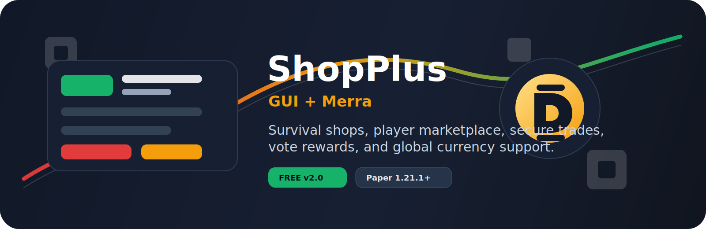

<p align="center">
  
</p>

<h1 align="center">ShopPlus GUI + Merra</h1>

<p align="center">
  Premium Minecraft shop GUI, player marketplace, secure trades, voting rewards, and Merra global currency support.
</p>

<p align="center">
  <a href="https://github.com/oskarr8848/ShopPlus/releases/latest"></a>
  
  
  
</p>

<p align="center">
  <a href="#download">Download</a> |
  <a href="#features">Features</a> |
  <a href="#install">Install</a> |
  <a href="#merra">Merra</a> |
  <a href="#commands">Commands</a> |
  <a href="https://oskarr8848.github.io/ShopPlus/">Landing Page</a>
</p>

## What Is ShopPlus?

ShopPlus is a polished survival-economy shop suite for Minecraft servers. It gives players a clean `/shop`, server shops, player listings, sell menus, secure trades, live market pricing, vote reward hooks, and optional Merra global currency integration.

This repository is the public download and documentation page. It does **not** contain the ShopPlus source code.

## Download

| File | Version | SHA256 |
| --- | --- | --- |
| [`ShopPlus-2.0.jar`](releases/ShopPlus-2.0.jar) | `2.0` | `117064dae42dc80b275cafe80f0b212e365b0d7b0a5f9a2f90fc7ee3b552ffa6` |

The same jar is also published on the [latest GitHub release](https://github.com/oskarr8848/ShopPlus/releases/latest).

## Features

- **Server Shop GUI** with category-based item menus.
- **Player Marketplace** for player-owned listings through `/list`, `/mylist`, and `/unlist`.
- **Sell Menu** for fast inventory selling and worth checks.
- **Secure Trades** with accept and deny flow.
- **Live Market Prices** with admin reset/report tooling.
- **Vault Economy Support** for compatibility with common economy stacks.
- **Merra Global Currency** with account linking and PlaceholderAPI support.
- **Voting Rewards** with rank, discount, and Merra-point hooks.
- **Claim Block Items** for survival servers using GriefPrevention-compatible setups.

## Install

1. Download [`ShopPlus-2.0.jar`](releases/ShopPlus-2.0.jar).
2. Put it in your server `plugins/` folder.
3. Install **Vault** and a Vault economy provider.
4. Restart the server.
5. Run `/shopreload` after editing ShopPlus config files.

Full install guide: [`docs/INSTALL.md`](docs/INSTALL.md)

## Requirements

| Type | Requirement |
| --- | --- |
| Server | Paper `1.21.1+` |
| Required | Vault plus one Vault economy provider |
| Optional | PlaceholderAPI, GriefPrevention, Essentials, CMI |
| Java | Java compatible with your Paper build |

## Merra

Merra is the global currency layer for ShopPlus. Servers connect to the Merra API, not directly to the universal database. This keeps the database private while letting servers use linking, points, rewards, and placeholders.

Primary placeholder:

```text
%mcnp_merra_points%
```

More detail: [`docs/MERRA.md`](docs/MERRA.md)

## Commands

| Command | Use |
| --- | --- |
| `/shop` | Open the main shop menu. |
| `/servershop` | Open server shop categories. |
| `/playershop` | Open player marketplace listings. |
| `/sell` | Open sell GUI. |
| `/worthlist [page]` | View live buy/sell prices. |
| `/list <price>` | List your held item stack for sale. |
| `/mylist` | View your active listings. |
| `/unlist <number>` | Remove one listing. |
| `/trade <player>` | Send a trade request. |
| `/tradeaccept [player]` | Accept a trade. |
| `/tradedeny [player]` | Deny a trade. |
| `/link discord <discord id or username>` | Start Merra Discord linking. |
| `/verifymerra <code>` | Verify a Merra link code. |

Admin and reward commands are documented in [`docs/COMMANDS.md`](docs/COMMANDS.md).

## Status

ShopPlus is currently offered as a **free early-access binary** while the public product page and Merra licensing system are being prepared. This is the official free download point for now. Commercial licensing, hosted Merra keys, and support tiers may be added later.

## Support

- Open an issue for bugs or installation problems.
- Include your Paper version, ShopPlus version, Vault economy plugin, and relevant console logs.
- Do not post Merra API keys, Discord bot tokens, database credentials, or private server IPs in public issues.

## License

ShopPlus is distributed as a closed-source binary. See [`LICENSE.md`](LICENSE.md) before redistributing, modifying, decompiling, or selling the jar.
